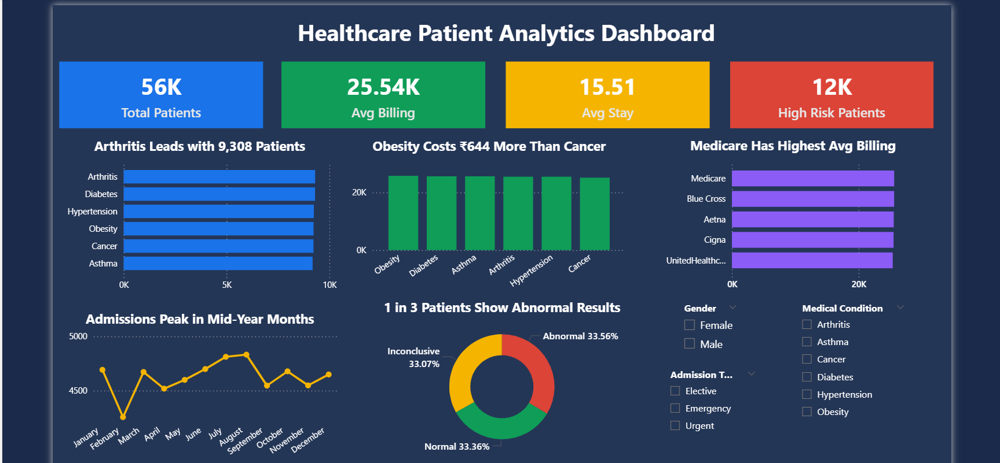

# Healthcare Patient Analytics Project

## Overview
End-to-end data analytics project analyzing 55,500 patient 
records to uncover clinical and operational insights.

## Tools Used
- Python (Pandas) - Data cleaning and exploratory analysis
- MySQL - Business queries and patient segmentation  
- Power BI - Interactive dashboard and visualization

## Dataset
- Source: Kaggle Healthcare Dataset
- Rows: 55,500 patients
- Features: 15 columns including Age, Medical Condition, 
  Billing Amount, Admission Type, Test Results

## Key Insights
- Arthritis is the most common condition with 9,308 patients
- Obesity has the highest average billing at 25,805
- 1 in 3 patients show Abnormal test results
- 12,331 high-risk patients identified from Urgent and 
  Emergency admissions with Abnormal results
- Cancer high-risk patients have the longest average 
  stay at 15.8 days

## Project Structure
- analysis.py — Data cleaning and EDA using Pandas
- queries.sql — 10 business queries in MySQL
- healthcare_dashboard.png — Power BI dashboard screenshot

## Dashboard Preview

## Author
Vanitha N  
Data Analyst | Python(Pandas) | SQL | Power BI | Excel

LinkedIn: https://linkedin.com/in/vanitha-n-161a043b3  
Email: vanithavijay2103@gmail.com
